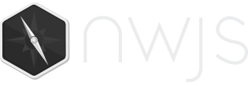

# nwjs.io


* * *


This is the source for the NW.js public website.

**To contribute**:

1. Fork and clone this repo.
2. Branch off of `develop`.
3. Follow the instructions in **Prerequisites** to set up your environment.
4. Follow the instructions in **Run the site**.
5. Follow other instructions if they are relavent to your contribution.
6. Submit Pull Requests against the `develop` branch.


* * *


## Prerequisites

### **Node.js 5.x** with NPM

**Node 5 on OSX and Windows**

1. Go to [NodeJS.org](http://nodejs.org)
2. Download Node 5
3. Install like normal

**Node 5 on Ubuntu**:

1. Point to Node.js 5.x: `curl -sL https://deb.nodesource.com/setup_5.x | sudo -E bash -`
2. Install Node.js: `sudo apt-get install -y nodejs`
3. Install NPM: `sudo apt-get install npm`
4. Create a symbolic link for node `sudo ln -s /usr/bin/nodejs /usr/bin/node`

### **Bower**

1. Install Node and NPM (see above)
2. Install Bower: `npm install -g bower`

### **Editor Config**

We use "editorconfig" to help maintain code consistency across different IDE's.

1. Go to [EditorConfig.org](http://editorconfig.org/#download)
2. Click on your IDE/Text Editor of Choice and follow the instructions


* * *


## Run the site

See the "Prerequisites" section above for more information.

Run:

```bash
npm install
bower install
npm run serve
```

Then open [localhost:3000](http://localhost:3000) in your browser.


* * *


## Build the website

If you just want to build the website, run

```bash
npm run build
```

The website will be built and stored in the `build` directory.


* * *


## Add New Blog

Just write a new markdown in `src/blog` and it will automatically generate the pages. Then you have to **reload your browser** to see the changes.


* * *


## Add New Downloads

Edit `/src/versions.json` and append your new versions of downloads and switch `stable` or `latest` to your new version number. Then reload your browser to see the changes.


* * *


## Update Google Analytics

The GA script is in [templates/partials/ga.hbs](templates/partials/ga.hbs) and the `UA` is defined in [src/config.json](src/config.json).
