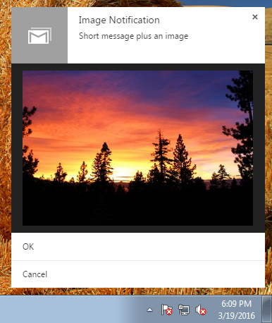
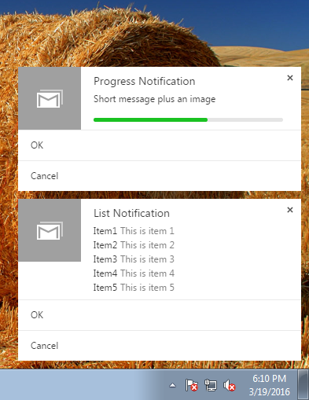
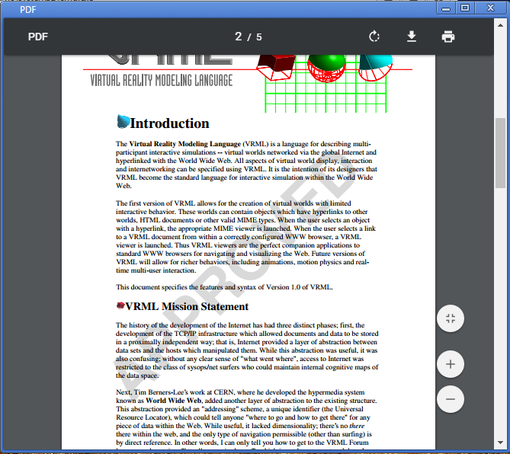
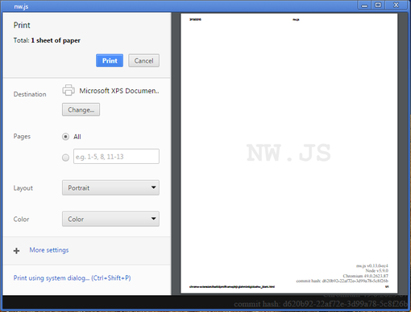
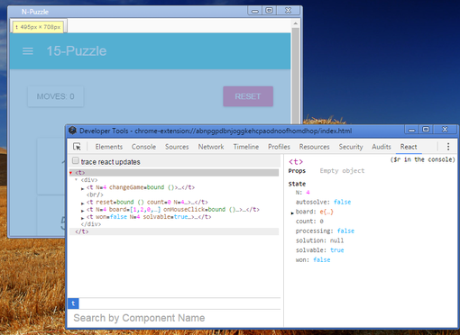
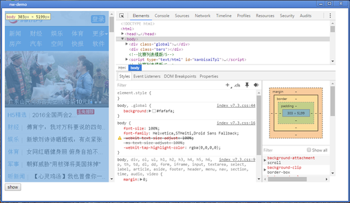

# {{{title}}}
{{{date}}}
## Overview

NW.js v0.13 brings most features in the Chromium browser, including Chrome Apps support, chrome.* platform APIs, NaCl and Pepper plugin, builtin PDF viewer, printing preview, rich notifications and many more. This is done by following upstream closely with an adjusted architecture. We also expect faster release cycle and better stability with the new architecture in 2016.

This post introduces the following topics for the new release:
- `chrome.*` API support
- Chrome (Packaged) App support
- More Features from Chromium Browser
- Better Native Node.js Module Support
- Full DevTools Extension Support and Embed Devtools as Part of Your App
- Content Verification
- Official Documentation
- Multiple Build Flavors
- Mixed Context Mode
- Under the hood
- Changes and migration
- Acknowledgements

## chrome.* API support

In previous 0.12 version we started to support chrome.webRequest API to let you intercept network requests made by DOM. In this version we bring even more of chrome.* API. Including rich notification, context menu, usb, etc.

With rich notifications you can put buttons, lists, images, icon and progress bar in the notification.


  
*Rich notifications*

See the upstream docs for the listing of chrome APIs: we support all `chrome.*` API in the [Chrome App platform](https://developer.chrome.com/apps/api_index). In addition, we support some chrome.* API in the [Extension Platform](https://developer.chrome.com/extensions/api_index). There is document tracks the [list of them](http://docs.nwjs.io/en/v0.13.0/References/Chrome%20Extension%20APIs/).

NW developers follows upstream changes closely and bring them to the application developers. Previously in 0.12 we used the new code cache feature in the V8 engine to improve [JS source code compilaton](http://docs.nwjs.io/en/v0.13.0/For%20Users/Advanced/Protect%20JavaScript%20Source%20Code/)

## Chrome (Packaged) App support

After supporting many chrome.* APIs, the manifest spec for Chrome Apps are also supported in straightforward way. That means many Chrome Apps can be run directly on NW. Clone the [sample apps repository](https://github.com/GoogleChrome/chrome-app-samples) and run one of them with:

```bash
$ /path/to/nw.exe <folder path of the manifest.json file>
```

or drag the folder to the NW executable. CRX packaging for Chrome Apps is not supported but you can use the packaging mechanisms provided by NW. See [package document](http://docs.nwjs.io/en/v0.13.0/For%20Users/Package%20and%20Distribute/) for more. Also see [thousands of Chrome Apps online](https://chrome.google.com/webstore/category/apps?_feature=chromeapp).

And of course Node.js APIs can be accessed from Chrome App: add “node” permission to manifest.json and you are ready to call nw.require().

So NW supports 2 kinds of applications now: Chrome Apps and NW Apps. The one with a ‘manifest.json’ file is a Chrome App (with an exception below), while NW App is the one with ‘package.json’. They run in different security model: Chrome Apps run in the same model from Chromium upstream; NW App runs in the native “Node” security model provided by NW platfrom. Apps that has “node” permission in ‘manifest.json’ is a NW App.

The native security model tries to provide you the maximum capability as in a traditional C++ desktop application. You can access all the chrome.* APIs without declaring permission in manifest, load all Node.js libraries and DOM operations are not limited by cross origin checks and CSP any more. Untrusted contents are still running in the same security model from Chromium browser. For more information, see [Security in NW.js](http://docs.nwjs.io/en/v0.13.0/For%20Users/Advanced/Security%20in%20NW.js/).

## More Features from Chromium Browser

NW.js application develpers have been asking for more browser features and compatibility between NW.js and Chromium upstream. With the new browser component based architecuture *(see "under the hood" section below)*, we are now able to provide many features in the Chromium browser, including print preview, PDF viewer and SSL client certificates. Below are some samples:

[](../images/pdf.png)  
*The built-in PDF viewer*

[](../images/print.png)  
*Print Preview*

[](http://engineroom.teamwork.com/resurrecting-clippy/)  
*[Clipper made by Adam Lynch](http://engineroom.teamwork.com/resurrecting-clippy/) with the Transparency feature in NW*


## Better Native Node.js Module Support

Native modules built for Node.js can be loaded into NW.js now. The previous tool to build them for NW.js -- 'nw-gyp' is not needed any more. In Linux and OSX you can just load the native module built for Node.js directly. In windows you'll need to replace a file installed by Node. See more information in the [announcement](https://groups.google.com/d/msg/nwjs-general/UqEq8ito2gI/W-ld9LSoDQAJ).

## Full DevTools Extension Support and Embed Devtools as Part of Your App

NW.js is now able to fully support devtools extensions, including the one for ReactJS etc. To use them, see [the guide here](http://docs.nwjs.io/en/v0.13.0-beta7/For%20Users/Debugging%20with%20DevTools/#using-devtools-extensions).

[](../images/react.png)  
*Debugging React App easily with React Devtools Extension*

A method is added to webview tag, so you can launch devtools for this webview. Besides opening a new devtools window, You can also place the devtools UI in a webview. This enables IDE software for better UI. See [the doc](http://docs.nwjs.io/en/v0.13.0-beta7/References/webview%20Tag/#webviewshowdevtoolsshow-container) for more information.

[](../images/devtools.png)  
*A sample IDE for debugging mobile web page on the desktop*

## Content Verification

The new feature 'content verification', or 'app signing', prevents loading unsigned files with your official binary. Given a keypair, you sign the application files and redistribute the signature file with your application. The public key is built into your NW.js binary. If users or 3rd party modified the files. NW will report the file is corrupted and quit immediately.

See [the official document for this feature](http://docs.nwjs.io/en/v0.13.0/For%20Users/Advanced/Content%20Verification/) for more information.

## Official Documentation

Starting from this version, the official documentation is maintained in the same repo we use for development, and is available in http://docs.nwjs.io . Welcome to submit PR for it. Documents for the previous versions will be in the wiki as usual.

## Multiple Build Flavors

There are 3 builds for each platform - normal build, sdk build and Nacl build. Normal build doesn't have devtools, only SDK build does. lt can be opened by pressing F12 (Cmd-Alt-I on OSX). SDK packages also have more development tools to be exposed in the following releases, as well as the NaCl support. 

Our build infrastructure enables live binary build from git tip so you can access to the latest binary from http://dl.nwjs.io/live-build/ 

## Mixed Context Mode

In this mode, Node.js objects and DOM objects reside in the same Context (thus will be destroyed upon navigation). The trade-off is that mixed mode is easier to use in some cases, while the normal mode provides better isolation and supports navigation or multi-page application better. For more information, see the discussion in [#3107](https://github.com/nwjs/nw.js/issues/3107).

## Under the hood

Under the hood for this improvement is the effort made by upstream to move the extension mechanism towards the Content layer, as well as componentizing the [browser modules](https://www.chromium.org/developers/design-documents/browser-components). NW will evolve with upstream towards the “app shell” architecture. In future we’ll split the browser components as separate loadable modules so the binary size can be shrunk significantly.

[](../images/arch.png)  
*NW13 architecture*

We are also using it to refactor the implementation of ‘nw.gui’ library in 0.12. The extension mechanism provide a lightweight and elegant solution for JS API binding. With it we are able to eliminate the overhead of additional IPC messages used in previous version. 

## Changes and migration

We also changed the API to put everything from the ‘nw.gui’ library into the ‘nw’ object. To provide API compatibility with 0.12 applications, we evaluate a [builtin shim script](https://github.com/nwjs/nw.js/blob/nw13/src/resources/nw_pre13_shim.js) at window context creation. It simulates the API  provided by 'require('nw.gui')'. 

Refer to the [migration guide](http://docs.nwjs.io/en/v0.13.0/For%20Users/Migration/From%200.12%20to%200.13/) if you have 0.12 application. We have been working to make the changes minimal under the new architecture.

## Acknowledgements

Thanks to the following people for their contributions to the release:
* Liu Cong: porting APIs, documentation and tests
* Jefry Tedjokusumo from V-cube Global Services: transparency and click-through feature
* Kevin Fan: keeping Chromium rebased to 47-49 and Node.js to 5.x
* Chase Willden: porting APIs
* Adam Lynch, Mithgol, Kyle Robinson Young, Steffen Müller, etc for package tools
* And to all the people who submit bug reports, wiki docs and answering questions in mailing list and gitter channel!
